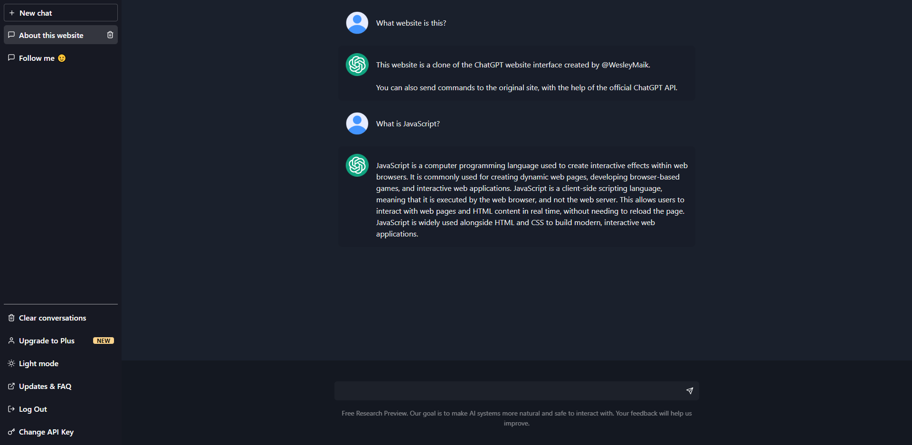
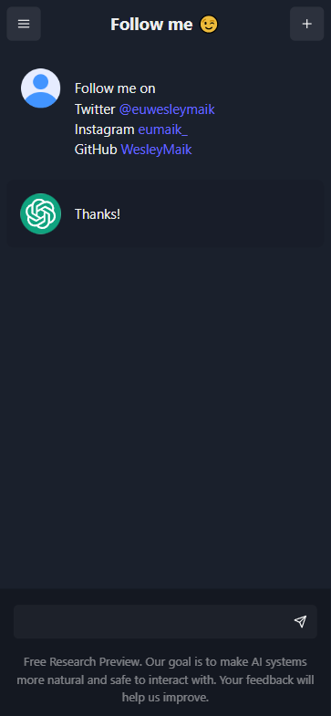

# ChatGPT UI Clone

A clone of the ChatGPT website UI
demo: https://wesleymaik.github.io/chatgpt-ui-clone

---

<div align="center">




## </div>

## Requirements

- node >= v16.16.0
- npm or yarn

## Built with

- ViteJS (React)
- ChakraUI
- React Query
- Zustand
- OpenAI API

## Getting Started

1. Clone the project

```
git clone https://github.com/WesleyMaik/chatgpt-ui-clone
```

2. Install dependencies

```
npm install
```

or

```
yarn install
```

3. Environment (important)
   Create an .env file at the root of the project with the following key:

```
//.env
VITE_CHATGPT_SECRET_KEY = your OpenAI API key
```

4. Run 🔥

```
npm run dev
```

or

```
yarn dev
```

---

### Feedback

Feedback is appreciated! Reach out on [Twitter](https://twitter.com/euwesleymaik), [Instagram](https://twitter.com/euwesleymaik) or submit a new issue!

---
"ChatGPT", "OpenAI" and its respective logos are owned by OpenAI Inc. All rights are reserved by the company. My intention with the project is just for study and no monetization is being generated from it.
